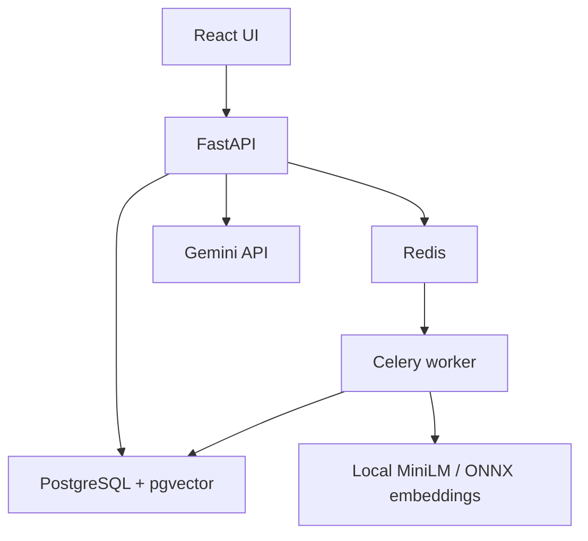

# RAG Explorer

A production-minded Retrieval-Augmented Generation application that makes every stage of a grounded answer visible: PDF ingestion, background processing, local embeddings, vector retrieval, evidence scoring, Gemini generation, and citations.

The project is designed as a backend-focused portfolio system without treating the frontend as an afterthought. It runs as a complete multi-container environment in GitHub Codespaces.

## What this project does

RAG combines information retrieval with a Large Language Model (LLM). Instead of asking Gemini to answer only from its general training knowledge, this application first searches the documents uploaded by the user and then gives the model the relevant evidence needed to answer.

The complete flow is:

1. The user uploads a PDF.
2. The backend validates the file, extracts its text, and divides it into overlapping passages.
3. A local embedding model converts each passage into a numerical vector.
4. PostgreSQL with pgvector stores those vectors and searches them when a question is submitted.
5. The backend selects relevant passages. Generic document-overview questions use representative passages, while specific factual questions use semantic similarity and an evidence threshold.
6. Gemini receives the question and retrieved evidence—not the complete document—and produces a grounded answer with citations.
7. The frontend displays the answer, cited passages, retrieval information, source pages, and retrieval/generation latency.

## Objective and portfolio value

The objective is to demonstrate the complete engineering pipeline behind evidence-grounded AI applications, rather than only placing a chat interface in front of an LLM API. It shows how document ingestion, asynchronous processing, local embeddings, vector search, access control, prompt construction, generation, citations, and user feedback work together as one system.

The project demonstrates:

- Retrieval-Augmented Generation architecture and semantic search
- Free, local document embeddings with `all-MiniLM-L6-v2`
- Grounded Gemini answers constrained to retrieved evidence
- Source citations, page references, retrieval scores, and latency visibility
- Asynchronous PDF processing with Redis and Celery workers
- FastAPI, PostgreSQL, pgvector, React, TypeScript, and Docker Compose
- Automated GitHub Codespaces setup, testing, continuous integration, security controls, and documented operational tradeoffs

This is not intended to be a general-purpose chatbot. It is an inspectable reference implementation showing how an LLM can answer questions about user-provided documents while making the origin of its answer visible.

## Run in GitHub Codespaces

1. Open this repository on GitHub.
2. Select **Code → Codespaces → Create codespace on main**.
3. If prompted, select **Yes, I trust the authors** so Codespaces can open a terminal and run the setup.
4. Wait for `.devcontainer/setup.sh` to build and start all containers. The first build downloads Python, Node, and machine-learning dependencies and can take several minutes.
5. When the terminal is ready, print the frontend URL yourself:

   ```bash
   bash .devcontainer/print-url.sh
   ```

6. Open the printed URL. If it does not open, go to the **Ports** tab, locate port **3000**, and select **Open in Browser**.

The application intentionally does not open a browser automatically. Codespaces may execute setup before the user has accepted repository trust or before an interactive terminal is visible; the command above puts the timing under the user's control.

## Try the application

1. Create a free Gemini API key in [Google AI Studio](https://aistudio.google.com/app/apikey).
2. Paste it into **Connect Gemini** and verify it. The key remains only in the current page's memory and is never stored in PostgreSQL, Redis, local storage, source code, or logs.
3. Upload a text-based PDF and watch it move through queued, processing, and ready states.
4. Ask a question and inspect the retrieved passages, similarity scores, page citations, and latency breakdown.

Do not submit confidential documents or secrets to a public demo. Free-tier Gemini data handling is governed by Google's current terms.

The default generation model is the stable free-tier `gemini-3.1-flash-lite`. The Codespaces setup automatically migrates the earlier demo default when resuming an existing environment.

## Architecture at a glance



- **Ingestion:** FastAPI validates and stores PDFs, then enqueues processing.
- **Processing:** Celery extracts text, chunks pages with overlap, and generates embeddings locally with a CPU-focused ONNX runtime.
- **Retrieval:** PostgreSQL/pgvector ranks chunks by cosine similarity and applies an evidence threshold; overview requests use representative document passages.
- **Generation:** only retrieved evidence, citation labels, and the question are sent to Gemini.
- **Presentation:** React shows operational states, answers, sources, scores, and timing.

## Documentation

| Guide | Contents |
|---|---|
| [Architecture](docs/architecture.md) | Components, request flows, design decisions, and scaling |
| [Backend](docs/backend.md) | FastAPI, data model, worker, retrieval, and API endpoints |
| [Frontend](docs/frontend.md) | React structure, security decisions, states, and UX |
| [RAG pipeline](docs/rag-pipeline.md) | Extraction, chunking, embeddings, search, prompts, and citations |
| [Operations](docs/operations.md) | Docker, Codespaces, observability, troubleshooting, and production gaps |
| [Security](docs/security.md) | Key handling, isolation, upload validation, and threat model |

## Local development

Requirements: Docker Engine with Docker Compose.

```bash
cp .env.example .env
docker compose up --build
```

- Frontend: `http://localhost:3000`
- OpenAPI/Swagger: `http://localhost:8000/docs`
- Readiness: `http://localhost:8000/health/ready`

Stop the environment with `docker compose down`. Add `-v` only when you intentionally want to erase databases, uploads, and cached models.

## Quality controls

GitHub Actions validates backend lint/tests, frontend lint/tests, the production frontend build, Compose configuration, and container builds on pushes and pull requests. No real performance, accuracy, or coverage number is claimed until it is measured by a reproducible benchmark.

## License

Released under the [MIT License](LICENSE).
